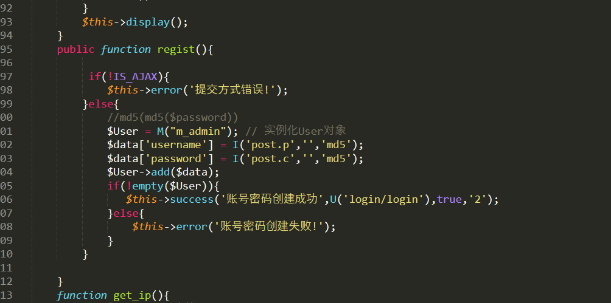

# 又一次登陆钓鱼网站
首先是钓鱼网站。

群里别的大哥扫描到源码和后台登陆页面。

直接就开干。先下载来文件

去里面审计一下

这里可以看到可以尝试注册，但是条件是IS_AJAX ，去百度搜一下，之前没用过think PHP。

这里可以直接通过更改头部文件来满足这个if，不然会出现提交方式错误。

这里直接更改头文件并进行创建

登陆的时候用户名为p参数的32位md5，密码则直接不变。登陆成功
